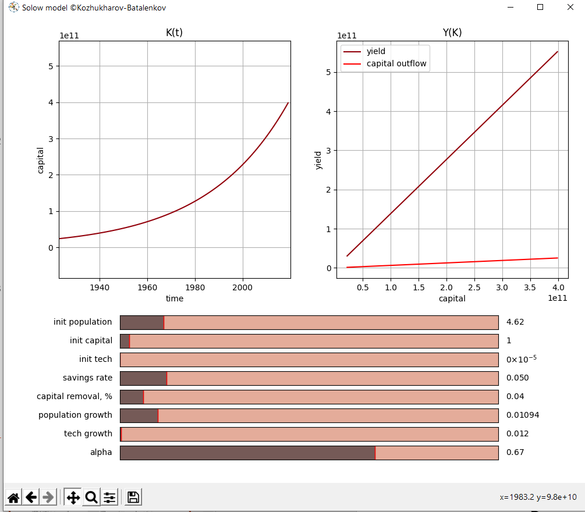
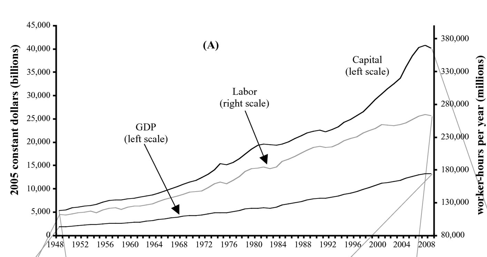

# Модель Солоу
## Что это?
Сделали небольшое исследование на тему экономической модели Солоу, подробности в отчете.

## Инструменты
* Python 3.8
* Matplotlib
## Итог
Все получилось, с историческими данными сошлось:

А вот исторические данные:

